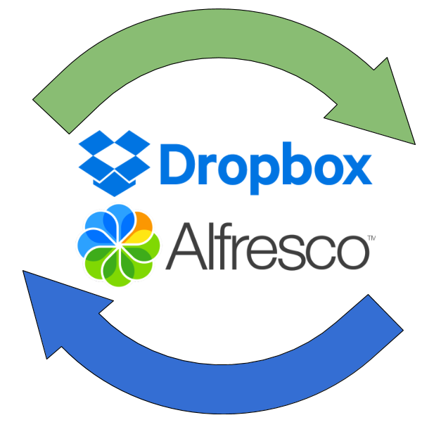

# Alfresco to Dropbox Connector

## Description

This project was developed to allow users to have synchronized content between
 Alfresco and Dropbox. It expands on Alfresco's original, now unsupported,
  integration [found here](https://github.com/Alfresco/alfresco-dropbox-integration).
   The project works by leveraging Dropbox's new API through
  [Dropbox's Java SDK](https://www.dropbox.com/developers/documentation/java) in order
  to make API calls to push and pull content between Alfresco and Dropbox.

    

 The Alfresco to Dropbox connector will allow users to synchronize files and folders between Alfresco and Dropbox.
 Synchronized folders will allow users to place content into a folder in Dropbox and have it appear in Alfresco, and vice versa.
 Users will be able to see if their content is currently synchronizing and be able to differentiate
 between synced content and un-synced content through use of indicators noted next to the content thumbnails in Alfresco.

## Installation and Support

To report a bug or issues, please use the [issues](https://github.com/FikaTechnologies/dropbox-connector/issues) page.

Installation, configuration, and general use instructions are available [here](https://github.com/FikaTechnologies/dropbox-connector/blob/dev/docs/install.md).

## Important to Note

 * Runs using Community and/or Enterprise assets (**Must** use Alfresco Community 5.0.b or higher and Alfresco Enterprise 5.0.2 or higher)
 * Polling has known issues of trying to sync with content that may not exist in Dropbox or Alfresco, and will throw errors. Use with Caution.

## Project RoadMap

  1. ~~Update project to use Dropbox java sdk instead of spring social dropbox connector, due to api version incompatibility~~
  2. ~~Update Metadata and other method calls in order to interact with Dropbox core sdk~~
  3. ~~Update Authentication to use oAuth2 and interact with Dropbox core sdk~~
  4. ~~Update poller to a working state~~
  5. ~~Add file copy support~~
  6. ~~Change authentication method to no longer support redirect, in favor of making set-up of app on Alfresco side rather than on Dropbox side~~
  7. ~~Allow poller to be configurable~~
  8. Improve documentation to include a README and installation and use guide
  9. Improved/enhanced error handling
  10. Code cleanup
  11. User interface clean up
  12. Apply for app to be considered a production level application for Dropbox
  13. Extensive testing and bugfixing
  14. JavaDoc support
  15. Generic Support of the extension

Licensed under the Apache License 2.0   
