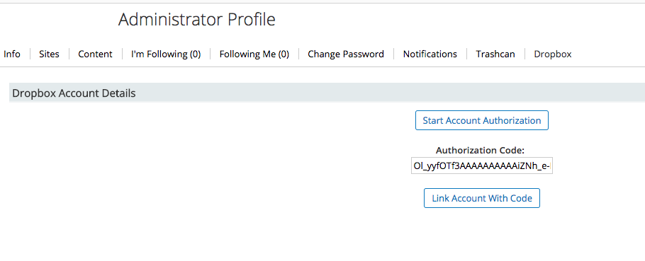
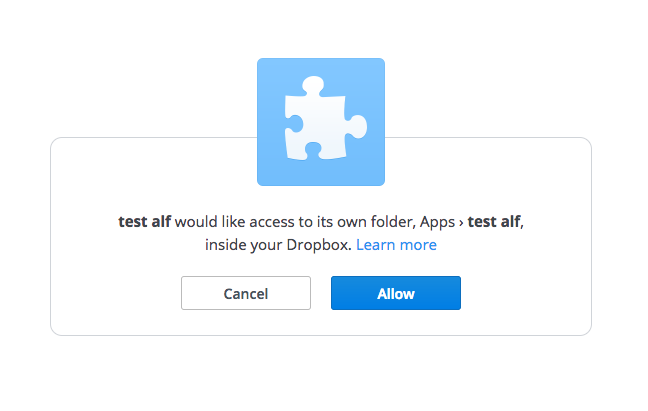
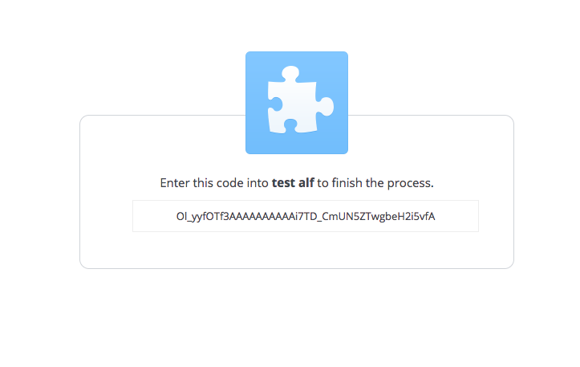
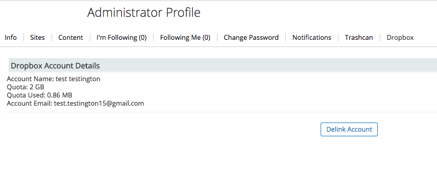
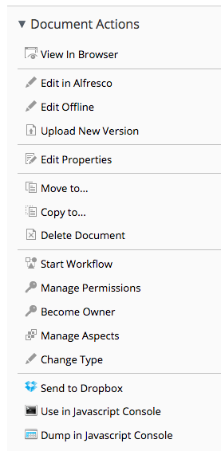
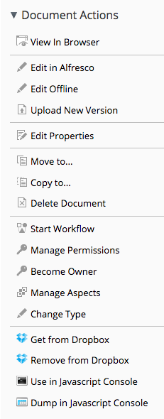
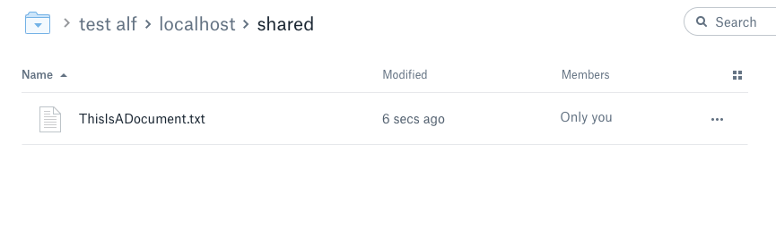

# Alfresco to Dropbox Connector Installation and Set up Guide

This is built on an All-In-One (AIO) project for Alfresco SDK 3.0.  Backwards compatible for Community version 5.0.b or higher. 

##Installation
Run project with `mvn clean install -DskipTests=true alfresco:run` or `./run.sh` and verify that it runs.

This project was built with the intention of extending an existing
 integration with Dropbox that due to limitations of the project, 
 could no longer function in any capacity (Dropbox's v1 API 
 was retired and the original project was built off of an sdk that utilized v1 endpoints). 
 
### Files
 
 1. dropbox-connector-platform-jar-1.0-SNAPSHOT.jar - This file contains all of the core repository extensions required to interact with Dropbox  
 2. dropbox-connector-share-jar-1.0-SNAPSHOT.jar  - This file contains all of the Share customizations for Alfresco  
 3. jmimemagic-0.1.2.jar - This file is a dependency for the jars to work properly  
 4. jackson-core-2.8.3.jar - This file is a dependency for the jars to work properly  
 5. dropnox-core-sdk-3.0.3.jar - This file is a dependency for the jars to work properly  
 
 OR  
 1. dropbox-connector-platform-jar-1.0-SNAPSHOT.amp - This file contains all of the core repository extensions required to interact with Dropbox
 2. dropbox-connector-share-jar-1.0-SNAPSHOT.amp - This file contains all of the Share customizations for Alfresco
 
### How to install into Alfresco Tomcat

  ##### - Jar Method:
   * Shut down Alfresco
   * Place platform jar into `{AlfrescoDir}/modules/platform`
   * Place Share jar into `{AlfrescoDir}/modules/share`
   * Place `.jar` files
    (`jmimemagic-0.1.2.jar`, `jackson-core-2.8.3.jar`, `dropbox-core-sdk-3.0.3.jar`)
      in the `tomcat/shared/lib` directory of your Alfresco directory.
   * Start Alfresco
  
  ##### - AMP Method:
   * Shut down Alfresco 
   * Place platform AMP into the `{AlfrescoDir}/amps` directory
   * Place share AMP into the `{AlfrescoDir}/amps_share` directory
   * Run `./apply_amps.sh -f` in the `{AlfrescoDir}/bin` directory
   * Start Alfresco
   
### Configuration

Configuring the tool requires changes to the **alfresco-global.properties** file.

The properties available are:

 1. dropbox.poller.cron - The cron expression of how often the poller should run.
 2. dropbox.poller.enabled - Whether or not the poller should run.

## Setup   
### How to connect your account

 * After login screen go to your user profile
 * From user profile, there should be a tab called "dropbox"
 * On the Dropbox tab user's should click the "Start Authentication" button  
   
 * A new tab will open in your browser with a login screen for your Dropbox credentials
  (if you're not logged in already, if you are, skip this step)
 * You will be asked to allow the connector to access your dropbox account  
   
 * When you click allow, you will be given a code  
   
 * Copy the code and paste it in your user profile and click the  "Link Account" button
 * This should link your account and refresh the page, giving you a view of your account stats
 (i.e. the amount of space available to you and how much you've used, etc.)  
   
 
### How to send content to Dropbox

 * You can send a document to Dropbox from the document actions  
   
 * Clicking the "Send to Dropbox" button will send your document to Dropbox.
  **Note:** If you haven't been through the Authentication process this will take you through
  The process of obtaining an authentication code. You will still need to use the "Link Account"
  button on your profile page in order to be fully authenticated
 * Once a document is sent to Dropbox your document actions will change  
   
 * The "Get from Dropbox" button will obtain any new versions or metadata from
  Dropbox. This is in case polling is not enabled,
   or the scheduled job hasn't run and you need your changes now
 * The "Remove from Dropbox" button will remove the file from Dropbox
  (performing a"soft delete") and will disallow Dropbox polling
   from syncing the document again
 * Below is a screenshot of what the content will look like from inside of
 Dropbox. This location is under the "Apps" folder, and in the case of
 this example, located under the "test-alf" directory  
   
 
 
 